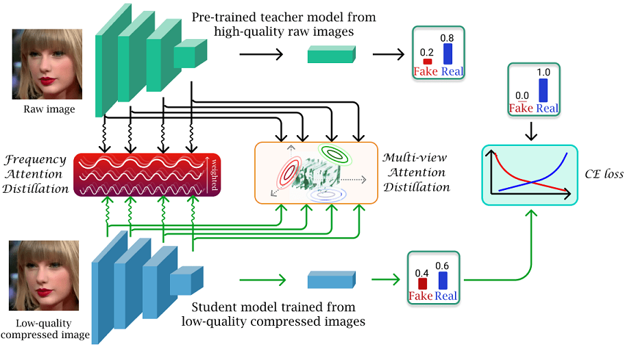
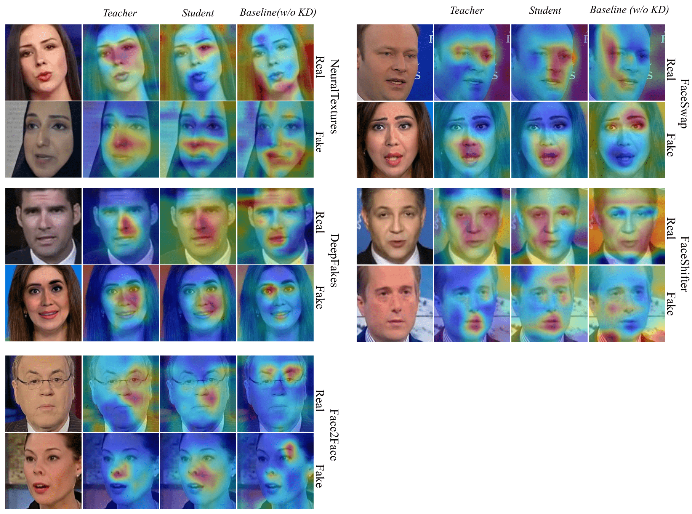

# Title - Paper ID 5610
Anonymous "Paper ID 5610".  International Conference on Computer Vision (ICCV). 2021. Montreal, Canada

## Overview of our framework.

    

## Datasets
* NeuralTextures
* DeepFakes
* Face2Face
* FaceSwap
* FaceShifter

## Grad-CAM

    

