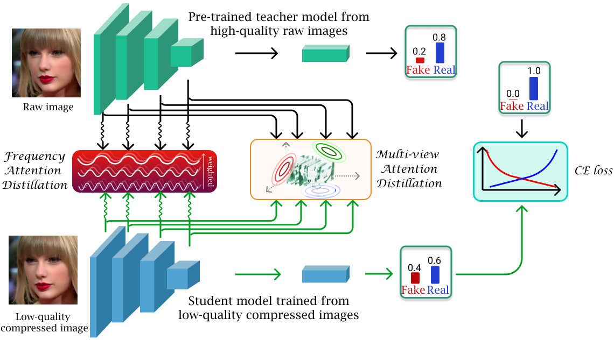
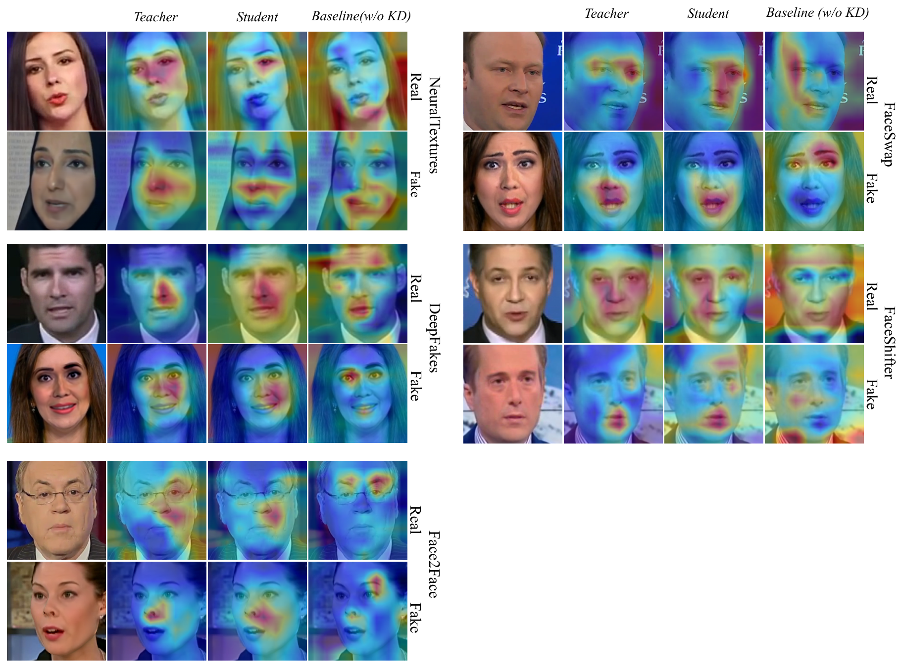

# Title - Paper ID 5610
Anonymous "Paper ID 5610".  International Conference on Computer Vision (ICCV). 2021. Montreal, Canada

## Overview of our framework.

## Dataset

NeuralTextures, DeepFakes, Face2Face, FaceSwap

## Grad-CAM

